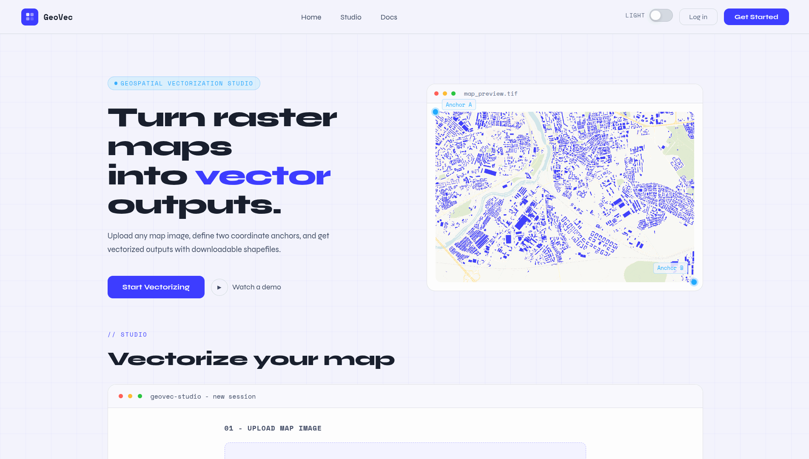
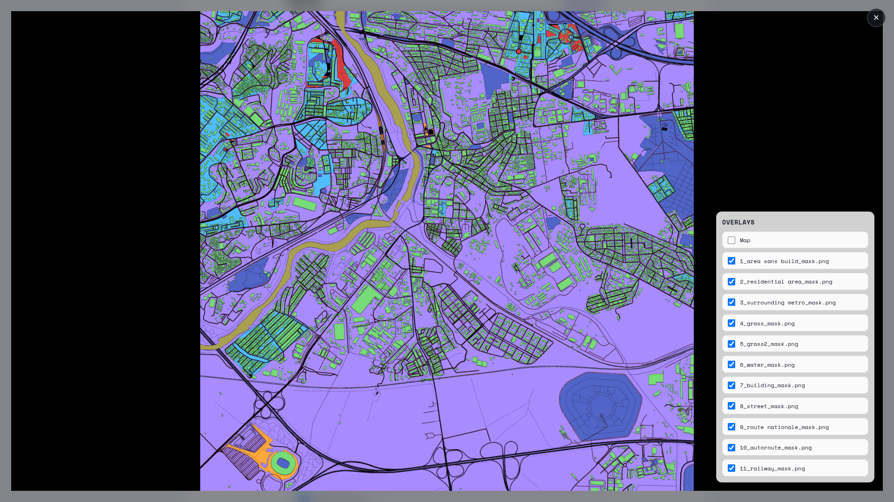

# geospatial-vectorization-pipeline



End-to-end pipeline for converting satellite and scanned imagery into structured geospatial vector data, including georeferencing, database creation, and topology validation.



## Architecture

```
┌─────────────────┐
│   Frontend      │
│  (Vite SPA)     │
│   :3000         │
└────────┬────────┘
         │
         ├──────────────────────────┐
         │                          │
┌────────▼────────┐     ┌───────────▼────────┐
│  API            │     │  Pipeline (async)  │
│  (FastAPI)      │     │  (Plombery)        │
│  :7860          │     │  :7860             │
└────────┬────────┘     └────────┬───────────┘
         │                       │
         └───────────┬───────────┘
                     │
               ┌─────▼─────────┐
               │  Postgres     │
               │  + HF Buckets │               
               └───────────────┘
```

## Services

### Pipeline (`services/pipeline`)
Async task orchestration using **Plombery**. Processes geospatial data through:
- Georeferencing (flow 1)
- Vectorization: lines, polygons, dotted boundaries (flow 2)
- Cleaning & gap-fill (flow 3)
- Visualization (flow 4)
- Export to database (flow 5)

**Runs at:** `localhost:8080`

### API (`services/api`)
FastAPI backend exposing REST endpoints:
- `/api/clients/*` - File upload & processing status
- `/api/media/*` - Result retrieval

Manages job submission to pipeline and tracks processing via SSE (Server-Sent Events).

**Runs at:** `localhost:8000` | Docs: `localhost:8000/docs` | Docker port: `7860`

### App (`services/app`)
Vite-based SPA for uploading geospatial images & visualizing results.

**Runs at:** `localhost:3000`

### Lab (`lab/`)
Experimental scripts and notebooks used to develop and test pipeline flows:
- `0_data.ipynb` - Data exploration & preparation
- `1_georef.py` - Georeferencing experiments
- `2_vectorization_*.py` - Vectorization prototypes
- `3_clean_*.py` - Cleaning & gap-fill iterations
- `6_viz_*.py` - Visualization development
- `7_validation_topo.py` - Topological validation

## Infrastructure

- **Database:** PostgreSQL for storing processing metadata & results
- **Storage:** HuggingFace buckets for input data & generated outputs
- **CI/CD:** GitHub Actions syncs code & models with HuggingFace
- **Deployment:** Pipeline service deployed on HuggingFace Spaces

## Get Started

1. Create a `.env` file by copying `.env.example` and fill it with your config
2. Run `docker compose up`
3. Open `localhost:3000` for the interface